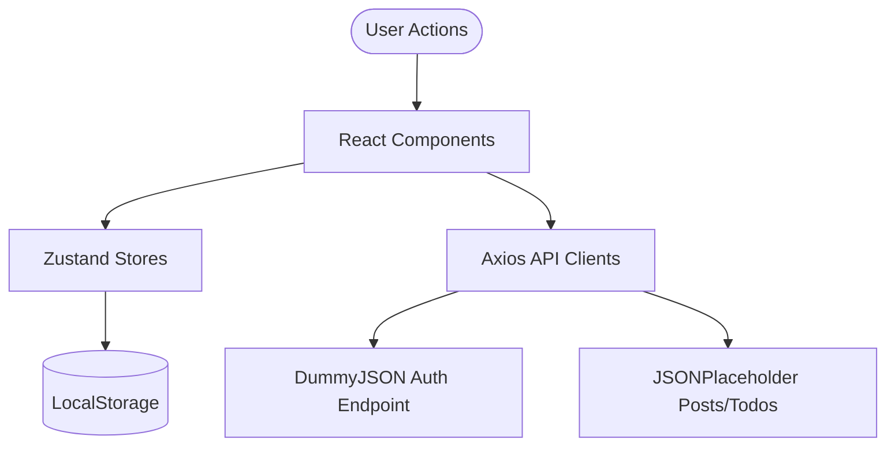

# SprintDesk — Production-grade Sprint Management Dashboard

SprintDesk is a single-page sprint management application built for software development teams to manage sprints, tasks, and velocity stats. This project features a clean React & TypeScript architecture, custom Tailwind CSS styling with glassmorphism aesthetics, drag-and-drop mechanics, reactive analytics charts, and a real-time notification polling manager.

Live Demo: (Provide deployment URL here)
GitHub Repository: (Provide GitHub repo link here)

---

## 🚀 Features & Modules

### 🔒 1. Authentication Flow
- **Interactive Login**: Standard credentials fields with client-side form validation.
- **Silent Token Refresh Interceptor**: Standard axios client appended with request and response interceptors. If a request returns a `401 Unauthorized`, it holds the requests in a queue, calls the refresh token endpoint (`https://dummyjson.com/auth/refresh`), updates the store, and retries the original requests seamlessly.
- **Session Persistence**: Verifies and maintains sessions on boot using refresh tokens.
- **Remember Me Functionality**: Option for a 30-day session persistence by calculating expiry times. Includes demo accounts click-to-autofill buttons.

### 📋 2. Interactive Kanban Sprint Board
- **4 Sprint Columns**: Backlog, In Progress, Review, and Done.
- **@dnd-kit Drag-and-Drop**: Supports column and card shifts with an animated `DragOverlay` implementing scale/tilt micro-animations.
- **Toolbar Filters**: Live search input, priority filters, and assignee filters.
- **Settings Editor Drawer**: Detailed task drawer sliding from the right to edit parameters (description, assignee, dates) and add comments.
- **Undo History Stack**: Multi-step action history allows reverting task movements, deletions, or creations.

### 📊 3. Analytics & Visualisation
- Derived dynamically from active store data:
  - **Sprint Velocity**: Completed vs. total tasks per sprint group.
  - **Task Distribution**: Column category density represented on a donut chart.
  - **Priority Breakdown**: Stacked bar charts depicting priorities across columns.
  - **Completion Trend**: Line charts tracing cumulative task completions over time.

### 🎨 4. Custom UI Component Library
Built entirely from scratch using Tailwind CSS (no external component frameworks like Radix, MUI, or Shadcn):
- `Button`: Multiple variants and loading states.
- `Input` & `Select`: Uniform inputs with labels, icon prefixes, and validation error messages.
- `Modal`: React Portals overlay with focus locks and escape-key listeners.
- `Toast`: Dynamic snackbars (success, error, warning, info) with auto-dismiss timers.
- `DataTable`: Generic sortable, searchable, paginated table widget.
- `Skeleton`: Custom pulse cards.

### 🔔 5. Simulated Real-Time Notifications
- **Background Polling Service**: Queries `https://jsonplaceholder.typicode.com/posts?_limit=5` every 10 seconds. New post IDs are mapped into notification badges.
- **Page Visibility Hooks**: Toggles polling intervals off when browser tab goes background and restarts on tab focus.
- **Toasts**: Shows alert warnings for new notifications if the dropdown is closed.

---

## 🛠️ Tech Stack & Requirements

| Area | Choice |
|---|---|
| **Framework** | React 18.3 |
| **Language** | TypeScript (Strict Mode) |
| **Build Tool** | Vite |
| **Data Fetching** | Axios + TanStack Query v5 |
| **Global State** | Zustand |
| **Styling** | Tailwind CSS v3 |
| **Routing** | React Router v6 |
| **Charts** | Recharts |
| **Drag & Drop** | @dnd-kit/core |
| **Testing** | Vitest + React Testing Library + JSDom |

---

## 🏗️ System Architecture

SprintDesk is designed with a feature-sliced directory structure separating API clients, state stores, custom layouts, and feature modules.

```
src/
├── api/                  # Axios clients & DummyJSON/JSONPlaceholder endpoints
├── components/           # Custom Reusable Component Library (design system)
│   ├── ui/               # Button, Input, Select, DataTable, Modal, Toast, Skeleton
│   └── layout/           # Sidebar, Navbar, AppLayout, PageContainer
├── features/             # Feature-based logic
│   ├── auth/             # Login Page, Guards
│   ├── board/            # Kanban Board columns, cards, drawers, modals
│   ├── analytics/        # Recharts visualisations
│   └── notifications/    # Bell, Poll trigger hooks
├── hooks/                # Global utilities (useToast)
├── store/                # Zustand global stores (auth, board, notification, theme)
├── types/                # Strict TypeScript typings
├── utils/                # Simulated storage utilities
├── App.tsx               # Route declarations & Query providers
├── index.css             # Tailwind baseline & Custom scrollbars
└── main.tsx              # Mounting entrypoint
```

### Data Flow



---

## 🧪 Testing Coverage

The project includes unit test coverage for the core state models and interceptors:
1. `useToast` Hook: Checks toast stack triggers, property assignments, and dismissals.
2. Zustand Board Store: Verifies task additions, order shifts inside `moveTask`, deletions, and history check-points.
3. Auth Interceptor: Verifies Bearer header injections, silent refresh calls to `/auth/refresh`, state updates, request queues, and fallback logouts on failure.

All tests pass successfully with exit code 0:
```bash
npm run test
```

---

## ⚙️ Installation & Setup

Follow these steps to run SprintDesk locally:

### 1. Clone the repository
```bash
git clone https://github.com/yourusername/sprintdesk.git
cd sprintdesk
```

### 2. Install dependencies
```bash
npm install
```

### 3. Start development server
```bash
npm run dev
```
The server will boot, typically accessible at `http://localhost:5173`.

### 4. Build project
To bundle for production deployment:
```bash
npm run build
```
The compiled files are created inside the `/dist` directory.

### 5. Running tests
```bash
npm run test
```

---

## 📝 Technical Decisions & Architectural Rationales
- **In-Memory Access Tokens**: For security best practices, the JWT `accessToken` is stored strictly in React memory. The `refreshToken` is handled via simulated local storage and automatically refreshed before expiration, protecting against XSS exploits.
- **Custom UI Components**: Built from raw Tailwind CSS utilities and HTML elements to avoid bundle bloating and ensure full control over layout semantics, responsive scaling, and accessibility parameters.
- **dnd-kit Choice**: Chosen for its lightweight structure, support for multiple sensors (pointers, touch, keyboard), and ease of integration compared to bulkier, less maintained options like `react-beautiful-dnd`.
